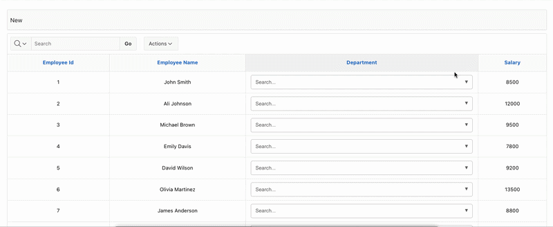

# Apex Search LOV From Query

A lightweight, reusable searchable LOV component for Oracle APEX, built from scratch using PL/SQL, JavaScript, and CSS.

This project introduces the `get_search_lov` function, allowing developers to generate a fully functional searchable List of Values (LOV) directly from a SQL query. The component automatically renders the required HTML and provides the JavaScript and CSS behavior, eliminating the need to rebuild the same UI for every page.

The component is powered by:
- PL/SQL (HTML generation)
- JavaScript (search, selection, dropdown behavior)
- CSS (styling and user interface)

It is designed to be lightweight, reusable, and easy to integrate into Oracle APEX applications.

## Features

- Generate a searchable LOV directly from a SQL query
- Search while typing
- Pure PL/SQL API
- No external APEX plug-ins required
- Lightweight and reusable
- Works with Interactive Reports
- Automatic HTML generation
- Built-in JavaScript and CSS behavior

## Demo



## Usage

```sql
SELECT
    employee_name,
    get_search_lov(
        department_id,
        q'[
            SELECT department_id,
                   department_name
            FROM departments
            ORDER BY department_name
        ]'
    ) AS department
FROM employees;
```

## License

MIT License
